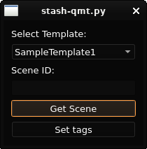
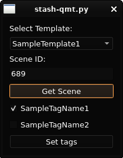

# stash-qmt
## What is it
stash-qmt (quick manual tagger) is a simple GUI tool designed to help with cases of manually tagging multiple similar scenes (manually, as in, with having to actually watch them) in [Stash](https://github.com/stashapp/stash).

## Disclaimer, what it isn't
stash-qmt is **not a stash plugin**. It's a Python app ran separately.

## How it works
You can provide stash-qmt with templates - lists of commonly used tags. Pick a template, type in the scene's id and stash-qmt will list down all of the template's tags that are not yet in the scene. Mark the tags you want to add, click "Set tags" and you can move to the next scene!

## Dependencies
- PyQt6
- requests
- PyYAML

## Installation and running the script
Make sure to have [pip](https://pip.pypa.io/en/stable/installation/) and [Python 3](https://www.python.org/downloads/) installed. Consider using a virtual environment to install and run the script, here's a [tutorial on them](https://www.freecodecamp.org/news/how-to-setup-virtual-environments-in-python/).
- Download and unpack the source code from the [latest release](https://github.com/PokerFacowaty/stash-qmt/releases/latest)
- Create and activate a virtual environment (if you decided to use one).
- Install dependencies with the command `pip install pyside6 requests pyyaml`
- Run the app with `python3 stash-qmt.py` (or `python` depending on your OS).

## Configuration
### Config.yaml
All configuration is stored in `config.yaml` in the same directory as the actual app.
If there isn't a `config.yaml` file in the directory, the app will create a sample one once it's running.

A sample `config.yaml` file is provided in the repository and looks like this:
```
# Find the docs at github.com/PokerFacowaty/stash-qmt
API Key: <your API key>
Stash URL: <Stash URL ending in /graphql>
Templates:
  SampleTemplate1:
    - SampleTagName1
    - SampleTagName2
  SampleTemplate2:
    12: TagWithId12
    33: TagWithId33
```
Explanation for all config entries:
- `API Key` - your Stash API Key found in `Settings -> Security`
- `Stash URL` - the url for your Stash instance with `/graphql` at the end
- `Templates:` - A dictonary keeping all your templates

### Adding templates:
- To add a template, simply pick a name for it and a list of tags it should consist of, like in the example (pay attention to the indentation):
```
Templates:
  SampleTemplate1:
    - SampleTagName1
    - SampleTagName2
```
- After you run the app at least once with a new template, it will change its look since the app stores the ids for all tags in the template locally:
```
  SampleTemplate2:
    12: TagWithId12
    33: TagWithId33
```
### Screenshots


